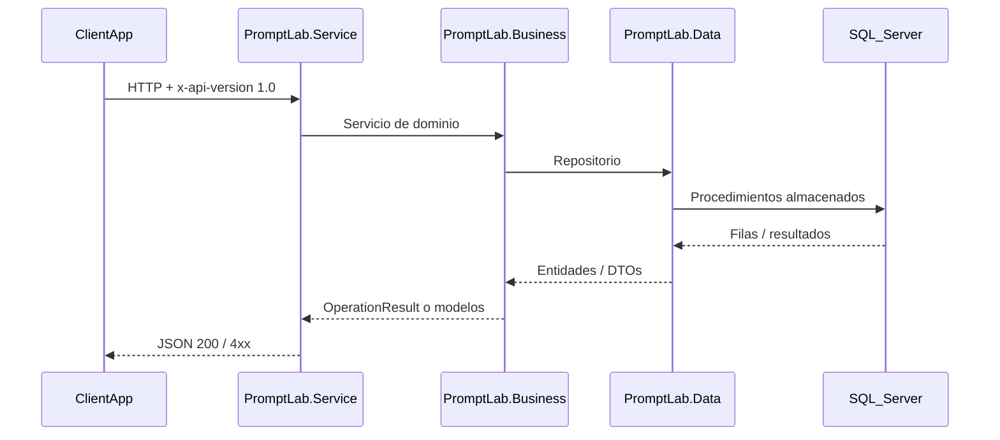

# Visión general

Prompt Lab sigue una arquitectura **en capas** con un **cliente SPA** (React + Vite) que consume una **API REST** versionada por cabecera.

## Flujo típico (request → response)

## Responsabilidades por capa

| Capa | Rol |
|------|-----|
| **PromptLab.Service** | Host ASP.NET Core, controladores, CORS, Swagger, versionado API. |
| **PromptLab.Business** | Reglas de negocio, caché en memoria, orquestación de análisis e integraciones. **No** referencia `PromptLab.Data` (regla verificada por tests de arquitectura). |
| **PromptLab.Data** | Acceso a datos con **RepoDb** y **SQL Server** mediante procedimientos almacenados. |
| **PromptLab.Entities** | Contratos de repositorio, DTOs y resultados de operación (`OperationResult`). |
| **PromptLab.Integrations** | Clientes HTTP y adaptadores hacia proveedores externos de IA. |

## Relación con el usuario

El usuario interactúa solo con el **ClientApp**. La API encapsula la persistencia y las integraciones; el front no conoce detalles de procedimientos almacenados ni conexiones SQL.

## Siguiente

- [Proyectos y dependencias](./02-proyectos-dependencias)
- [Stack tecnológico](./03-stack-tecnologico)
