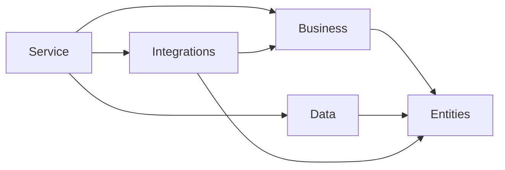

# Proyectos y dependencias

La solución `prompt-management-lab.sln` agrupa los proyectos bajo `src/PromptLab.Service/` y las pruebas en `src/tests/backend/`.

## Proyectos .NET

| Proyecto | Tipo | Depende de |
|----------|------|------------|
| **PromptLab.Service** | Web API (`net10.0`) | Entities, Data, Business, Integrations |
| **PromptLab.Business** | Biblioteca | Solo **Entities** |
| **PromptLab.Data** | Biblioteca | Entities |
| **PromptLab.Entities** | Biblioteca | (sin referencias a otros proyectos del repo) |
| **PromptLab.Integrations** | Biblioteca | Business, Entities |

## Regla de arquitectura

`PromptLab.Business` **no** debe referenciar `PromptLab.Data`. La composición (registrar repositorios en DI) ocurre en el host (`Program.cs` del servicio). Esta regla está cubierta por el test `ArchitectureDependencyTests.PromptLabBusiness_ShouldNotReferencePromptLabDataProject`.

## Paquetes destacados (API)

- **Asp.Versioning** — versionado por cabecera `x-api-version`.
- **Swashbuckle** — documentación OpenAPI / Swagger UI.

## Siguiente

- [Stack tecnológico](./03-stack-tecnologico)
