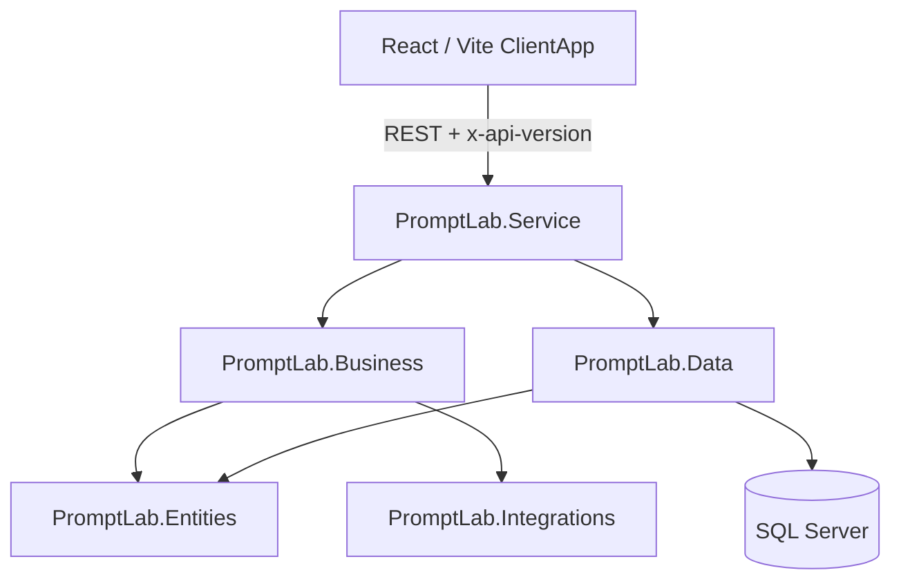

# Prompt Lab

**Prompt Lab** es una aplicación para gestionar **prompts** (plantillas de texto con variables), organizar **suites de pruebas** y **runs** de ejecución, y ejecutar **análisis con modelos de IA** (OpenAI, Anthropic, Google) de forma centralizada.

## Objetivos

- Versionar y etiquetar prompts.
- Definir casos de prueba asociados a un prompt y agruparlos en suites.
- Registrar resultados de runs (salida, latencia, score, errores).
- Ejecutar análisis contra proveedores de IA configurables.

## Mapa del sistema

## Dónde seguir

| Sección | Contenido |
|---------|-------------|
| [Arquitectura](./01-arquitectura/01-vision-general) | Capas, dependencias y stack. |
| [Funcional](./02-funcional/01-gestion-prompts) | Flujos de uso desde el punto de vista del producto. |
| [Backend](./03-backend/01-overview) | Servicios, datos, integración IA y configuración. |
| [Frontend](./04-frontend/01-overview) | Rutas, páginas, componentes y cliente HTTP. |
| [API](./05-api-referencia/01-endpoints) | Referencia de endpoints y modelos. |
| [Tests](./06-tests/01-estrategia) | Estrategia y cobertura de pruebas unitarias. |
| [Operaciones](./07-operaciones/01-arranque-local) | Arranque local y variables de entorno. |

## Código fuente

- API y dominio: `src/PromptLab.Service/`
- Cliente web: `src/PromptLab.ClientApp/`
- Pruebas de negocio: `src/tests/backend/PromptLab.Business.Tests/`
